# 🌾 Kashtkar.ai - Complete System Workflow Documentation

## 📋 Overview

Kashtkar.ai is an AI-powered agricultural intelligence platform that combines intelligent location detection, voice technology, real-time sensor data, and predictive analytics to provide farmers with comprehensive agricultural insights and recommendations.

---

## 🏗️ System Architecture

```
┌─────────────────────────────────────────────────────────────────┐
│                    KASHTKAR.AI SYSTEM ARCHITECTURE              │
├─────────────────────────────────────────────────────────────────┤
│                                                                 │
│  ┌─────────────┐  ┌─────────────┐  ┌─────────────┐              │
│  │  Frontend   │  │   Backend   │  │  External   │              │
│  │  (React.js) │  │  (Node.js)  │  │   APIs      │              │
│  └─────────────┘  └─────────────┘  └─────────────┘              │
│         │                 │                 │                   │
│         ├─────────────────┼─────────────────┤                   │
│         │                 │                 │                   │
│  ┌──────▼──────┐  ┌──────▼──────┐  ┌───────▼───────┐          │
│  │   Google    │  │   Google    │  │   Google      │          │
│  │   Maps API  │  │   AI Studio │  │   OAuth 2.0   │          │
│  └─────────────┘  └─────────────┘  └───────────────┘          │
│                                                                 │
│  ┌─────────────┐  ┌─────────────┐  ┌─────────────┐              │
│  │   Voice     │  │  Location   │  │  Real-time  │              │
│  │ Recognition │  │ Detection   │  │   Data      │              │
│  └─────────────┘  └─────────────┘  └─────────────┘              │
│                                                                 │
│  ┌─────────────┐  ┌─────────────┐  ┌─────────────┐              │
│  │ Sensor Data │  │  AI Agents  │  │  Analytics  │              │
│  │ Collection  │  │ Processing  │  │  Engine     │              │
│  └─────────────┘  └─────────────┘  └─────────────┘              │
└─────────────────────────────────────────────────────────────────┘
```

---

## 🔐 Authentication Workflow

### User Registration Flow

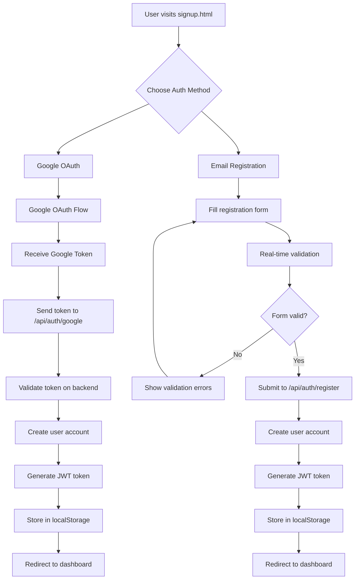

### Login Flow

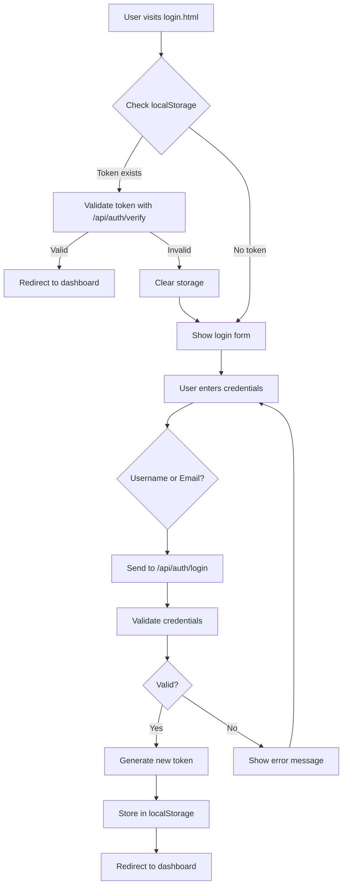

---

## 🧠 Intelligent Location Detection Workflow

### Message Processing Flow

```mermaid
graph TD
    A[User types message in chat] --> B[Send message]
    B --> C[Message reaches detectAndProcessLocation()]
    C --> D{Location detection enabled?}
    D -->|No| E[Skip location detection]
    D -->|Yes| F[Call analyzeMessageIntent()]
    F --> G{Analyze message content}

    G --> H{Direct location indicators?}
    H -->|Yes| I[High confidence - likely location query]
    H -->|No| J{Location patterns?}
    J -->|Yes| K[Medium confidence]
    J -->|No| L{Known locations?}
    L -->|Yes| M[Medium confidence]
    L -->|No| N[Low confidence - not location query]

    I --> O{Confidence > 50%?}
    K --> O
    M --> O
    N --> P[Skip location detection]

    O -->|Yes| Q[Call getLocationFromAIStudio()]
    O -->|No| P

    Q --> R[Send to Google AI Studio API]
    R --> S{AI response valid?}
    S -->|Yes| T[Parse coordinates]
    S -->|No| U[Use fallback geocoding]

    T --> V{Valid coordinates?}
    U --> V
    V -->|Yes| W[Call navigateMapToLocation()]
    V -->|No| X[Show error message]

    W --> Y[Update map position]
    Y --> Z[Add location marker]
    Z --> AA[Show info window]
    AA --> BB[Update map overlay]
    BB --> CC[Show chat feedback]
    CC --> DD[Speak voice feedback]
```

### AI Studio Location Processing

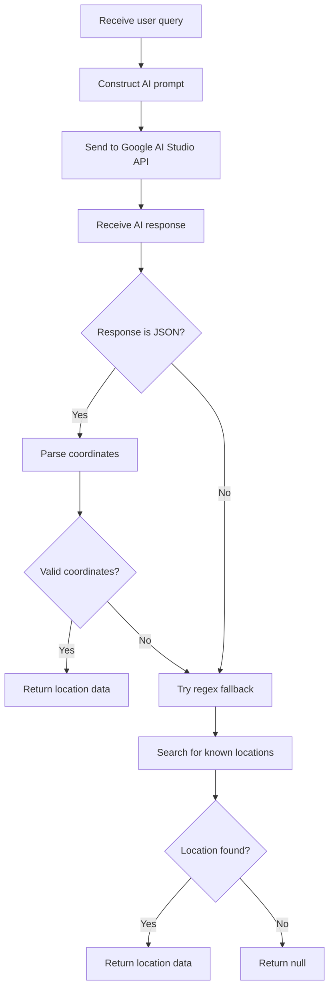

---

## 🎤 Voice Features Workflow

### Speech Recognition Process

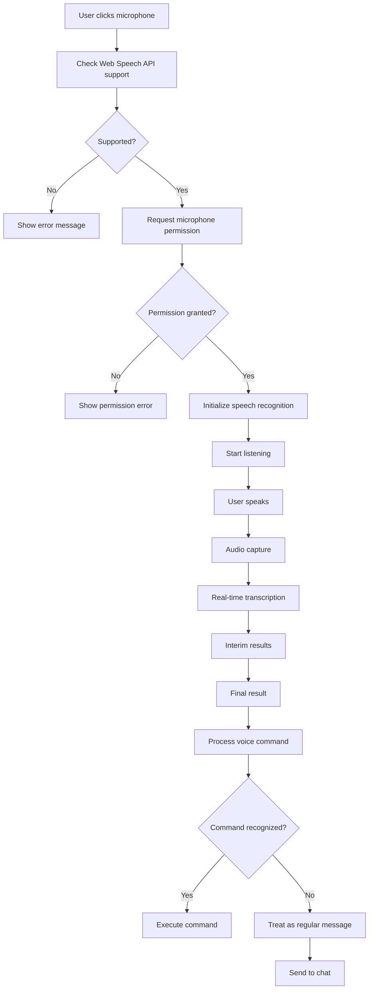

### Voice Command Processing

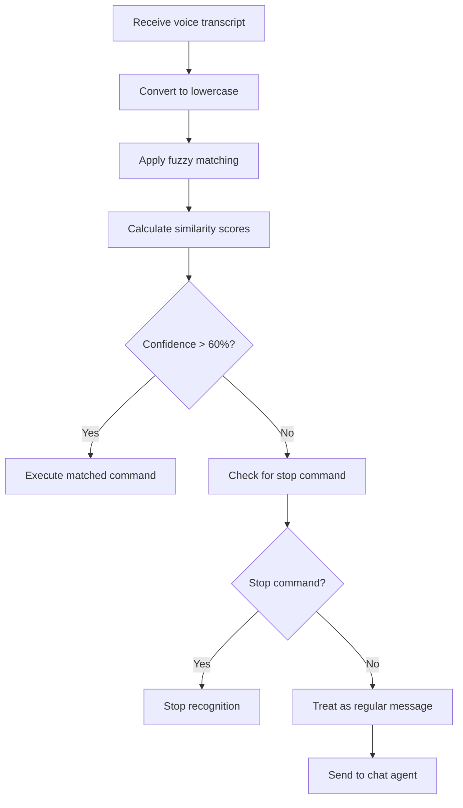

---

## 🗺️ Map Integration Workflow

### Location Navigation Process

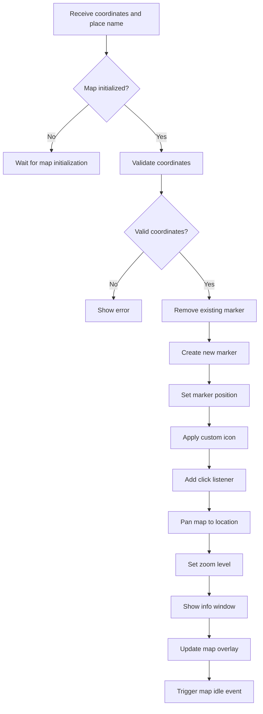

### Real-time Data Updates

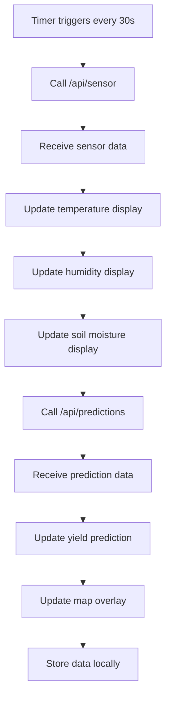

---

## 🤖 AI Agents Workflow

### Agent Selection and Processing

```mermaid
graph TD
    A[User selects agent chip] --> B[Update active agent]
    B --> C[Change agent color]
    C --> D[Update chat interface]
    D --> E[Show agent welcome message]
    E --> F[User sends message]
    F --> G{Which agent?}

    G --> H[Sensor Agent]
    G --> I[Prediction Agent]
    G --> J[Resource Agent]
    G --> K[Market Agent]

    H --> L[Call getSensorResponse()]
    I --> M[Call getPredictionResponse()]
    J --> N[Call getResourceResponse()]
    K --> O[Call getMarketResponse()]

    L --> P[Fetch /api/sensor data]
    M --> Q[Fetch /api/predictions data]
    N --> R[Fetch /api/resources data]
    O --> S[Fetch /api/market data]

    P --> T[Format sensor response]
    Q --> U[Format prediction response]
    R --> V[Format resource response]
    S --> W[Format market response]

    T --> X[Add to chat]
    U --> X
    V --> X
    W --> X
    X --> Y[Update map data]
    Y --> Z[Speak response if voice enabled]
```

### Sensor Data Collection

```mermaid
graph TD
    A[collectData() called] --> B[Get current timestamp]
    B --> C[Generate temperature data]
    C --> D[Generate humidity data]
    D --> E[Generate soil moisture data]
    E --> F[Generate rainfall data]
    F --> G[Generate wind speed data]
    G --> H[Generate solar radiation data]
    H --> I[Determine crop stage]
    I --> J[Get location data]
    J --> K[Compile sensor object]
    K --> L[Store to drive manager]
    L --> M[Check alert thresholds]
    M --> N{Alerts triggered?}
    N -->|Yes| O[Send alert notifications]
    N -->|No| P[Return sensor data]
    O --> P
```

---

## 🔄 Data Flow Architecture

### Component Communication

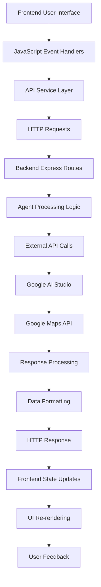

### State Management Flow

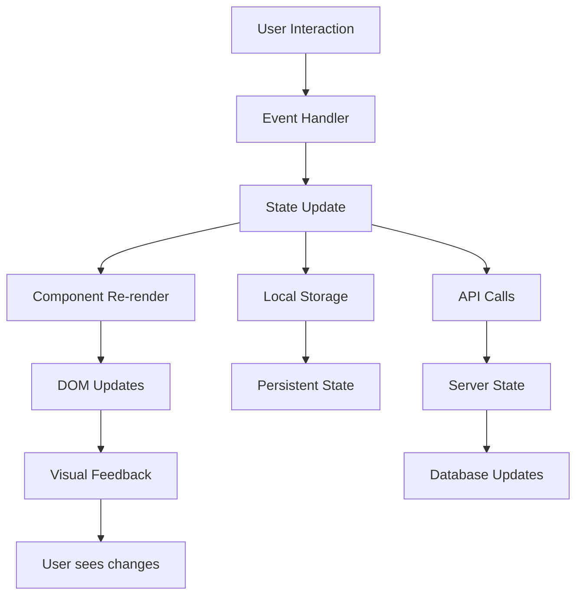

---

## 🛡️ Error Handling & Fallbacks

### Multi-Layer Error Recovery

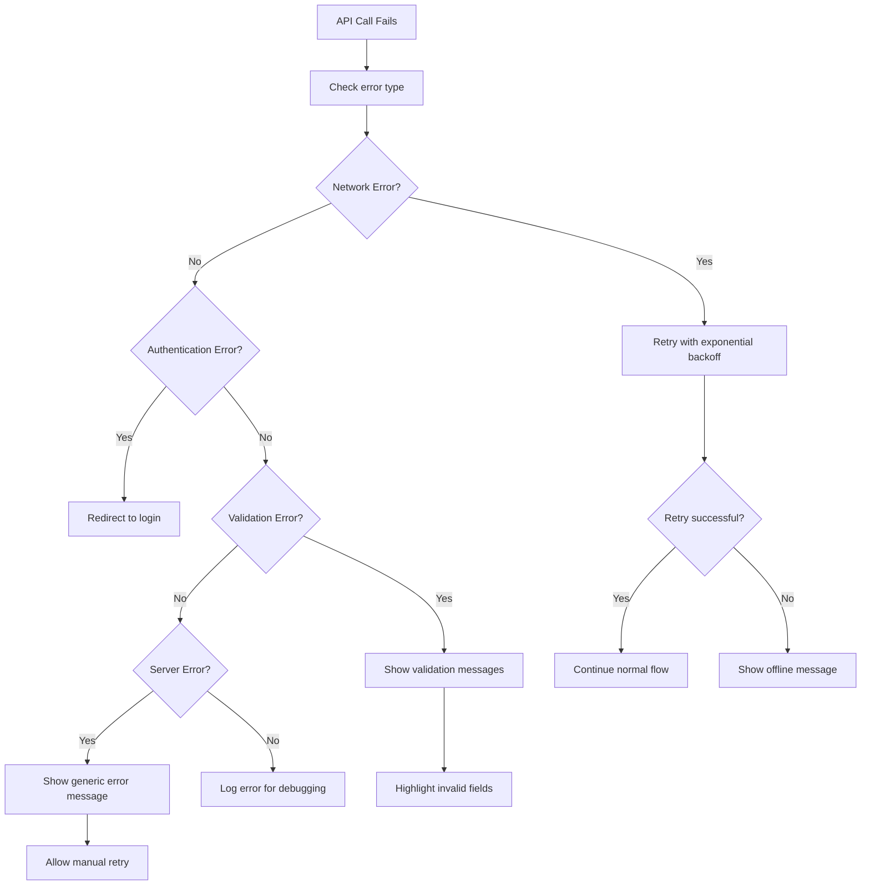

### Location Detection Fallbacks

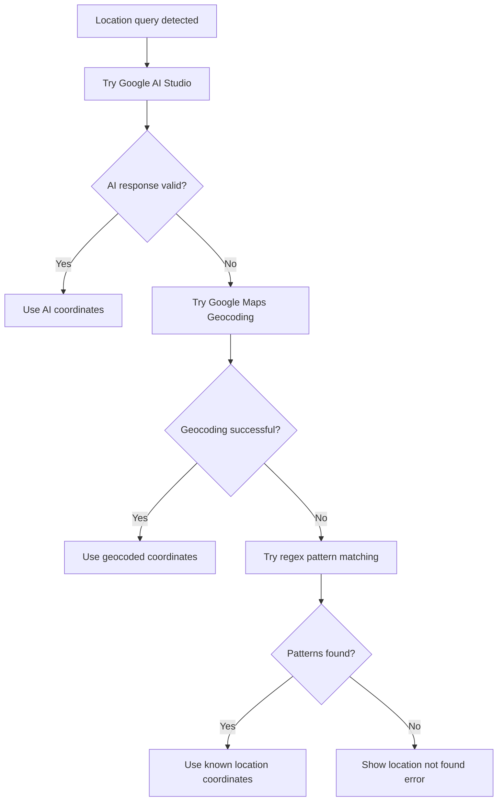

---

## 🎯 User Interaction Flows

### New User Onboarding

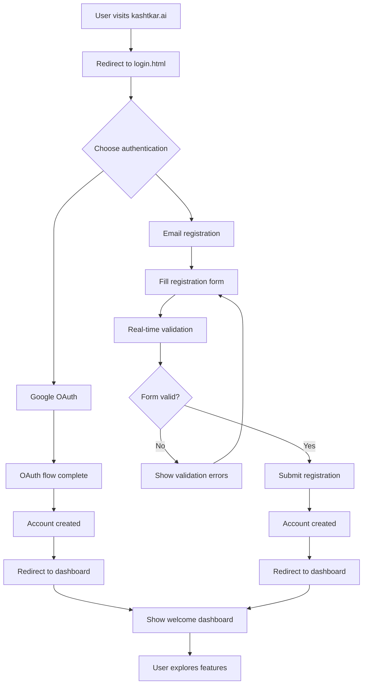

### Location-Based Query Flow

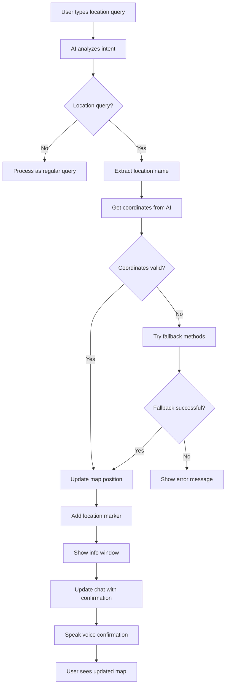

---

## 🔧 Technical Implementation Details

### Frontend Architecture

#### Component Structure
```
frontend.html
├── HTML Structure
│   ├── App Bar (Kashtkar.ai branding + user menu)
│   ├── Chat Interface (left panel)
│   │   ├── Agent selector chips
│   │   ├── Voice controls
│   │   ├── Chat messages
│   │   ├── Message input
│   │   └── Voice settings panel
│   └── Map Interface (right panel)
│       ├── Map header with controls
│       ├── Google Maps container
│       ├── Map overlay with data
│       └── Location detection status
├── CSS Styling
│   ├── Google Material Design 3
│   ├── Responsive breakpoints
│   ├── Animation keyframes
│   └── Component-specific styles
└── JavaScript Logic
    ├── State management
    ├── Event handlers
    ├── API communication
    ├── Voice processing
    ├── Map integration
    └── Utility functions
```

### Backend Architecture

#### API Endpoint Structure
```javascript
// Authentication endpoints
POST /api/auth/login     // Username/email + password login
POST /api/auth/register  // User registration
POST /api/auth/google    // Google OAuth authentication
GET  /api/auth/verify    // Token verification

// Agricultural data endpoints
GET /api/sensor         // Real-time sensor data
GET /api/predictions    // AI predictions and forecasts
GET /api/resources      // Resource allocation recommendations
GET /api/market         // Market analysis and pricing

// Location services
POST /api/location/parse // AI-powered location parsing
```

#### Agent Class Structure
```javascript
class SensorAgent {
    collectData()           // Generate real-time sensor data
    getTemperature()        // Temperature with seasonal variation
    getHumidity()          // Humidity with weather patterns
    getSoilMoisture()      // Soil moisture simulation
    checkAlerts()          // Alert threshold monitoring
}

class PredictionAgent {
    generatePredictions()   // AI-powered predictions
    predictYield()         // Crop yield forecasting
    predictPestRisk()      // Pest risk assessment
    predictHarvestDate()   // Harvest timing prediction
}

class ResourceAgent {
    allocateResources()     // Resource optimization
    calculateWaterNeeds()  // Irrigation planning
    optimizeFertilizer()   // Fertilizer recommendations
}

class MarketAgent {
    generateMarketRecommendations() // Market analysis
    predictPrices()       // Price forecasting
    assessRisks()         // Market risk assessment
}
```

---

## 📊 Data Models & Structures

### User Authentication Data
```javascript
{
    user: {
        id: "user_123",
        email: "farmer@kashtkar.ai",
        name: "John Farmer",
        avatar: "https://ui-avatars.com/api/...",
        role: "farmer",
        joinDate: "2025-01-01T00:00:00.000Z"
    },
    token: "kashtkar_token_abc123...",
    expiresAt: "2025-01-02T00:00:00.000Z"
}
```

### Sensor Data Structure
```javascript
{
    temperature: 28.5,      // Celsius
    humidity: 65.2,         // Percentage
    soilMoisture: 45.8,     // Percentage
    rainfall: 2.4,         // mm
    windSpeed: 12.3,        // km/h
    solarRadiation: 680,    // W/m²
    cropStage: "flowering", // Current growth stage
    location: {
        latitude: 31.5204,
        longitude: 74.3587,
        region: "Punjab",
        district: "Lahore"
    },
    timestamp: "2025-01-01T12:00:00.000Z"
}
```

### Location Detection Data
```javascript
{
    placeName: "Lahore",
    coordinates: {
        lat: 31.5204,
        lng: 74.3587
    },
    confidence: "high",
    source: "ai_studio",    // ai_studio, geocoding, or keyword_matching
    timestamp: "2025-01-01T12:00:00.000Z"
}
```

### Voice Command Structure
```javascript
{
    keywords: {
        "en-US": {
            start: ["start", "begin", "go"],
            stop: ["stop", "end", "finish"],
            help: ["help", "support", "assist"],
            repeat: ["repeat", "again", "once more"],
            home: ["home", "main", "back"],
            settings: ["settings", "options", "preferences"]
        },
        "ur-PK": {
            start: ["شروع", "چالو", "بولو"],
            stop: ["رک", "بند", "ختم"],
            help: ["مدد", "سپورٹ", "کیا کروں"],
            repeat: ["دوبارہ", "ریپیٹ", "پھر سے"],
            home: ["گھر", "ہوم", "شروعات"],
            settings: ["سیٹنگ", "ترتیبات", "آپشن"]
        }
    }
}
```

---

## 🔄 Real-Time Data Flow

### Sensor Data Collection Cycle
```mermaid
graph TD
    A[Timer triggers] --> B[Call collectData()]
    B --> C[Generate environmental data]
    C --> D[Apply seasonal variations]
    D --> E[Calculate crop stage]
    E --> F[Store to drive manager]
    F --> G[Check alert thresholds]
    G --> H[Update frontend displays]
    H --> I[Update map overlay]
    I --> J[Wait 30 seconds]
    J --> A
```

### Map Data Synchronization
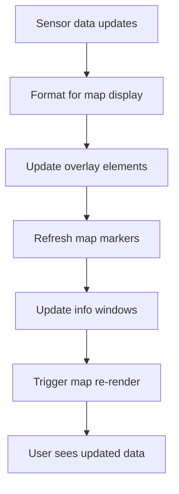

---

## 🎨 User Interface State Management

### Authentication State
```javascript
authState = {
    isAuthenticated: false,
    user: null,
    token: null,
    loading: false,
    error: null
}
```

### Location Detection State
```javascript
locationDetectionState = {
    detectionEnabled: true,
    isProcessing: false,
    lastDetectedLocation: null,
    currentQuery: null
}
```

### Voice Features State
```javascript
voiceState = {
    currentLanguage: "ur-PK",
    isListening: false,
    isSpeaking: false,
    recognition: null,
    synthesis: null,
    voices: [],
    currentVoice: null
}
```

### Map Interface State
```javascript
mapState = {
    isInitialized: false,
    currentLayer: "overview",
    currentLocation: null,
    markers: [],
    overlayData: null
}
```

---

## 🔒 Security & Privacy

### Authentication Security
- **Token-based authentication** with secure storage
- **Password validation** with strength requirements
- **Session management** with automatic timeout
- **Input sanitization** to prevent XSS attacks

### API Security
- **CORS configuration** for cross-origin requests
- **Input validation** on all API endpoints
- **Error handling** without information leakage
- **Rate limiting** considerations for production

### Data Privacy
- **Local processing** for voice commands when possible
- **No data storage** of voice recordings
- **User consent** for location and sensor data
- **Transparent data usage** policies

---

## 🚀 Performance Optimizations

### Frontend Performance
- **Lazy loading** of heavy components
- **Caching** of common API responses
- **Debounced** user input handling
- **Efficient** DOM manipulation

### Backend Performance
- **Connection pooling** for external APIs
- **Response caching** for static data
- **Asynchronous processing** for AI calls
- **Memory management** for sensor data

### Voice Performance
- **Adaptive quality** based on device capabilities
- **Background processing** for non-critical operations
- **Memory cleanup** for voice resources
- **Error recovery** with exponential backoff

---

## 🧪 Testing & Quality Assurance

### Automated Testing
- **API endpoint testing** with mock data
- **Voice feature testing** with simulated audio
- **Location detection testing** with various inputs
- **Authentication flow testing** with different scenarios

### Manual Testing Procedures
- **Cross-browser compatibility** testing
- **Mobile responsiveness** validation
- **Voice accuracy** testing across languages
- **Location detection** testing with various inputs

### Debugging Tools
- **Browser console logging** with detailed information
- **Network request monitoring** for API calls
- **Voice state debugging** with real-time status
- **Map rendering debugging** with coordinate validation

---

## 📈 Monitoring & Analytics

### System Monitoring
- **Server uptime** tracking
- **API response times** monitoring
- **Error rate** calculation
- **User session** analytics

### Performance Metrics
- **Page load times** measurement
- **Voice recognition accuracy** tracking
- **Location detection success** rates
- **User interaction** analytics

---

## 🔮 Future Enhancements

### Planned Features
- **Mobile application** with React Native
- **IoT sensor integration** with real devices
- **Advanced ML models** for better predictions
- **Multi-language expansion** beyond English/Urdu
- **Offline functionality** for remote areas

### Scalability Considerations
- **Microservices architecture** for better separation
- **Database integration** for persistent storage
- **Load balancing** for high availability
- **CDN integration** for global performance

---

## 📚 API Documentation

### Authentication Endpoints

#### POST /api/auth/login
**Request:**
```json
{
    "usernameOrEmail": "farmer@kashtkar.ai",
    "password": "securePassword123"
}
```

**Response:**
```json
{
    "success": true,
    "user": {
        "id": "user_123",
        "email": "farmer@kashtkar.ai",
        "name": "John Farmer",
        "role": "farmer"
    },
    "token": "kashtkar_token_abc123...",
    "expiresAt": "2025-01-02T00:00:00.000Z"
}
```

#### POST /api/location/parse
**Request:**
```json
{
    "query": "Show me agricultural data for Lahore"
}
```

**Response:**
```json
{
    "latitude": 31.5204,
    "longitude": 74.3587,
    "placeName": "Lahore, Punjab",
    "confidence": "high",
    "source": "ai_studio"
}
```

---

## 🎯 Conclusion

Kashtkar.ai represents a comprehensive agricultural intelligence platform that seamlessly integrates:

- **🤖 Artificial Intelligence** for intelligent location detection and natural language processing
- **🎤 Voice Technology** for hands-free interaction in multiple languages
- **🗺️ Interactive Mapping** for visual data representation and location-based insights
- **📊 Real-time Analytics** for sensor data processing and predictive recommendations
- **🔐 Secure Authentication** with professional user management
- **🎨 Modern Design** following Google's Material Design principles

The system provides farmers with an intuitive, AI-powered platform for making informed agricultural decisions through voice commands, intelligent location detection, and comprehensive data visualization.

---

**🌾 Kashtkar.ai - Revolutionizing Agriculture through AI-Powered Intelligence!**